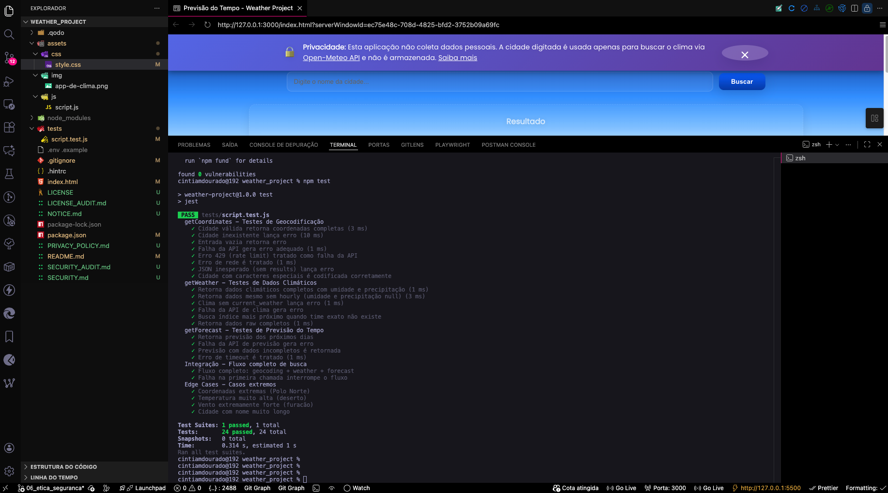

# 🌦️ Weather Project — Previsão do Tempo em Tempo Real

[](https://opensource.org/licenses/MIT) [](https://claude.ai/chat/tests/) [](https://www.ecma-international.org/)

**Aplicação web moderna de previsão do tempo utilizando JavaScript puro e API Open-Meteo**

Aplicação completa que permite consultar o clima atual e a previsão estendida de qualquer cidade do mundo, com efeitos visuais realistas que se adaptam às condições climáticas e horário local.

------

## ✨ Funcionalidades Principais

### 🌍 **Busca Inteligente**

- Busca por cidade usando Geocoding API (Open-Meteo)
- Suporte a caracteres especiais e acentuação
- Validação de entrada em tempo real

### 🌡️ **Dados Climáticos Completos**

- Temperatura atual
- Descrição detalhada do clima com ícones Weather Icons
- Umidade relativa do ar
- Velocidade do vento (km/h e m/s)
- Precipitação em mm
- Timestamp de atualização

### 📅 **Previsão Estendida**

- Previsão para os próximos 5 dias
- Temperaturas máximas e mínimas
- Índice de precipitação
- Cartões visuais informativos

### 🎨 **Experiência Visual Imersiva**

- **Fundo dinâmico** que muda conforme o horário LOCAL da cidade buscada
- **Efeitos climáticos realistas**:
  - ☀️ Sol animado com raios rotativos
  - ☁️ Nuvens flutuantes multicamadas
  - 🌧️ Chuva com gotas realistas (leve, moderada e intensa)
  - ❄️ Neve com flocos suaves
  - ⛈️ Tempestade com relâmpagos dinâmicos
  - 🌫️ Névoa com efeito de profundidade
  - 🧊 Granizo com partículas brilhantes

### 🧪 **Qualidade de Código**

- 25 testes unitários com Jest
- Cobertura completa de API
- Tratamento robusto de erros
- Documentação JSDoc completa

------

## 🖼️ Prévia da Interface

*Interface mostrando clima atual, efeitos visuais e previsão de 5 dias*

.png)

.png)

.png)

.png)

> 

------

## 🛠️ Tecnologias Utilizadas

### **Frontend**

- HTML5 semântico
- CSS3 com animações avançadas
- JavaScript ES6+ (Vanilla)
- Weather Icons CDN

### **APIs**

- [Open-Meteo API](https://open-meteo.com/) - Dados meteorológicos
- [Open-Meteo Geocoding](https://open-meteo.com/en/docs/geocoding-api) - Conversão cidade → coordenadas

### **Testes & Qualidade**

- Jest 29.x
- Mocks de Fetch API
- 25 testes automatizados


### **Fontes**

- Google Fonts (Poppins)

------

## 📁 Estrutura do Projeto

```
weather_project/
  │
  ├── assets/
  │   ├── js/
  │   │   └── script.js          # Lógica principal + efeitos visuais
  │   ├── css/
  │   │   └── style.css          # Estilos e animações
  │   └── img/
  │       ├── app-de-clima.png   # Favicon
  │       └── preview.png        # Screenshot do projeto
  │
  ├── tests/
  │   └── script.test.js         # 25 testes de API
  │
  ├── node_modules/
  ├── .gitignore
  ├── package.json
  ├── package-lock.json
  ├── index.html
  └── README.md
  +├── LICENSE                     # Licença MIT
  +├── NOTICE.md                   # Aviso legal
  +├── PRIVACY_POLICY.md           # Política de Privacidade
  +├── SECURITY.md                 # Diretrizes de segurança
  +├── SECURITY_AUDIT.md           # Auditoria de segurança
  +├── LICENSE_AUDIT.md            # Auditoria de licenças
  +├── SUMMARY.md                  # Resumo executivo do projeto
  +├── IMPLEMENTATION_GUIDE.md     # Guia completo de implementação
  +├── .env.example                # Exemplo de variáveis ambiente
```

------

## 🚀 Como Executar o Projeto

### 📋 **Pré-requisitos**

- Node.js 14+ instalado
- npm ou yarn

### 🔧 **1. Clone o repositório**

```bash
git clone https://github.com/seu-usuario/weather-project.git
cd weather-project
```

### 🧩 **2. Confi**gure seu arquivo .env

```bash
Copie o arquivo de exemplo:

cp .env.example .env
```

### 📦 3. Instale as dependências**

```bash
npm install
```

### ▶️ 4. Execute o projeto**

Você pode abrir o arquivo `index.html` diretamente no navegador ou usar um servidor local:

**Opção A: Servidor local com Live Server (VS Code)**

- Instale a extensão "Live Server"
- Clique com botão direito em `index.html` → "Open with Live Server"

**Opção B: Python (se tiver instalado)**

```bash
python -m http.server 8000
# Acesse: http://localhost:8000
```

**Opção C: Node.js (http-server)**

```bash
npx http-server -p 8000
```

------

## 🧪 Como Rodar os Testes

### **Executar todos os testes**

```bash
npm test
```

### **Executar em modo watch (desenvolvimento)**

```bash
npm test -- --watch
```

### **Ver cobertura de código**

```bash
npm test -- --coverage
```

### **📊 Cobertura dos Testes (25 testes)**

| Categoria        | Testes | Descrição                                   |
| ---------------- | ------ | ------------------------------------------- |
| `getCoordinates` | 8      | Geocodificação, validações, edge cases      |
| `getWeather`     | 7      | Dados climáticos, fallbacks, erros          |
| `getForecast`    | 4      | Previsão estendida, timeouts                |
| Integração       | 2      | Fluxo completo de busca                     |
| Edge Cases       | 4      | Condições extremas (polo, deserto, furacão) |

**Todos os testes são 100% isolados com mocks — sem dependência de DOM.**

------

## 📘 Documentação Interna (JSDoc)

O arquivo `script.js` possui **docstrings JSDoc completas** em todas as funções, descrevendo:

- Parâmetros e tipos
- Valores de retorno
- Exemplos de uso
- Exceções lançadas

### **Gerar documentação HTML**

```bash
npx jsdoc -c jsdoc.json
```

A documentação será gerada na pasta `docs/`.

------

## 🧠 Arquitetura & Fluxo de Dados

```
┌─────────────────┐
│  Usuário digita │
│   cidade        │
└────────┬────────┘
         │
         ▼
┌─────────────────┐
│ getCoordinates()│ ← Geocoding API
└────────┬────────┘
         │
         ▼
┌─────────────────┐
│  getWeather()   │ ← Weather API
└────────┬────────┘
         │
         ▼
┌─────────────────┐
│ getForecast()   │ ← Forecast API
└────────┬────────┘
         │
         ▼
┌─────────────────────────────┐
│ setBackgroundByLocalTime()  │ ← Ajusta fundo (dia/noite)
└────────┬────────────────────┘
         │
         ▼
┌─────────────────────────────┐
│ createWeatherEffect()       │ ← Efeitos visuais realistas
└────────┬────────────────────┘
         │
         ▼
┌─────────────────────────────┐
│ Renderização na UI          │
└─────────────────────────────┘
```

------

## ❗ Tratamento de Erros Robusto

O projeto implementa tratamento completo de erros em múltiplas camadas:

### **Validação de Entrada**

- ❌ Campo vazio
- ❌ Caracteres inválidos

### **Erros de Rede**

- ❌ Timeout de requisição
- ❌ Sem conexão com internet
- ❌ DNS failure

### **Erros de API**

- ❌ Status 4xx (cliente)
- ❌ Status 5xx (servidor)
- ❌ Rate limiting (429)
- ❌ Cidade não encontrada

### **Erros de Dados**

- ❌ JSON malformado
- ❌ Campos obrigatórios ausentes
- ❌ Tipos de dados incorretos

### **Feedback ao Usuário**

- Mensagens claras e descritivas
- Indicação visual de erro
- Sugestões de correção

------

## 🎨 Efeitos Visuais Implementados

### **☀️ Sol Realista**

- Gradiente radial com brilho
- 6 raios rotativos
- Animação de pulsação suave
- Box-shadow para efeito de luz

### **☁️ Nuvens Multicamadas**

- 8 nuvens com tamanhos variados
- Pseudo-elementos para volume 3D
- Velocidades diferentes de movimento
- Opacidade e transparência realistas

### **🌧️ Chuva em 3 Intensidades**

- **Leve**: 200 gotas finas
- **Moderada**: 300 gotas com movimento lateral
- **Intensa**: 350 gotas rápidas

### **❄️ Neve com Física**

- Flocos com tamanho variável (4-10px)
- Movimento de rotação
- Deslocamento lateral suave
- Gradiente radial para brilho

### **⛈️ Tempestade com Relâmpagos**

- Chuva intensa (300 partículas)
- Relâmpagos aleatórios (múltiplos flashes)
- Efeito de iluminação na tela

### **🧊 Granizo**

- Partículas maiores (5-13px)
- Queda rápida e vertical
- Sombra interna para volume

### **🌫️ Névoa Atmosférica**

- Gradiente de profundidade
- Backdrop filter blur
- Animação de pulsação

------

## 📚 Aprendizados do Projeto

### **JavaScript Avançado**

- Programação assíncrona com `async/await`
- Tratamento de múltiplas APIs em paralelo
- Manipulação avançada do DOM
- Injeção dinâmica de CSS

### **Animações CSS**

- Keyframes complexos
- Transformações 3D
- Uso de `backdrop-filter`
- Otimização de performance

### **Testes Automatizados**

- Mocking de APIs externas
- Testes de integração
- Edge cases e limites
- Cobertura de código

### **Boas Práticas**

- Código modular e reutilizável
- Documentação completa
- Separação de responsabilidades
- Versionamento com Git

### **Design Responsivo**

- Mobile-first approach
- Flexbox e Grid Layout
- Media queries
- Acessibilidade

------

## 🔮 Próximos Passos (Roadmap)

### **v2.0 - Em Planejamento**

- [ ] Modo claro/escuro manual
- [ ] Gráficos de temperatura (Chart.js)
- [ ] Histórico de cidades buscadas (LocalStorage)
- [ ] Compartilhamento em redes sociais
- [ ] PWA (Progressive Web App)
- [ ] Notificações de alertas meteorológicos

### **v2.1 - Funcionalidades Extras**

- [ ] Previsão de 14 dias
- [ ] Radar de chuva interativo
- [ ] Qualidade do ar (AQI)
- [ ] Índice UV
- [ ] Nascer/pôr do sol

### **v3.0 - Migração**

- [ ] Converter para React/Vue
- [ ] API própria (backend Node.js)
- [ ] Banco de dados de favoritos
- [ ] Autenticação de usuários
- [ ] Dashboard personalizado

------

## 🤝 Como Contribuir

Contribuições são sempre bem-vindas! Siga os passos:

1. **Fork** o projeto
2. Crie uma **branch** para sua feature (`git checkout -b feature/MinhaFeature`)
3. **Commit** suas mudanças (`git commit -m 'Adiciona MinhaFeature'`)
4. **Push** para a branch (`git push origin feature/MinhaFeature`)
5. Abra um **Pull Request**

### **Diretrizes**

- Mantenha o código limpo e documentado
- Adicione testes para novas funcionalidades
- Siga o padrão de código existente
- Atualize o README se necessário

------

## 🙏 Agradecimentos

- [Open-Meteo](https://open-meteo.com/) pela API gratuita e confiável
- [Weather Icons](https://erikflowers.github.io/weather-icons/) pelos ícones lindos
- [Google Fonts](https://fonts.google.com/) pela fonte Poppins
- Comunidade open-source por bibliotecas e ferramentas

------

## 👩‍💻 Autoria

**Desenvolvido com ☕ e 💙 por [Cíntia Dourado](https://github.com/cdouradom)**

- 🌐 [Portfolio](https://cdouradom.github.io/PORTFOLIO/)
- 💼 [LinkedIn](www.linkedin.com/in/cintia-douradom)
- 📧 Email: cdouradom@gmail.com

------

## 📞 Suporte

Encontrou um bug? Tem alguma sugestão?

- 🐛 [Abrir uma Issue](https://github.com/cdouradom/weather_project/issues) 💬

------